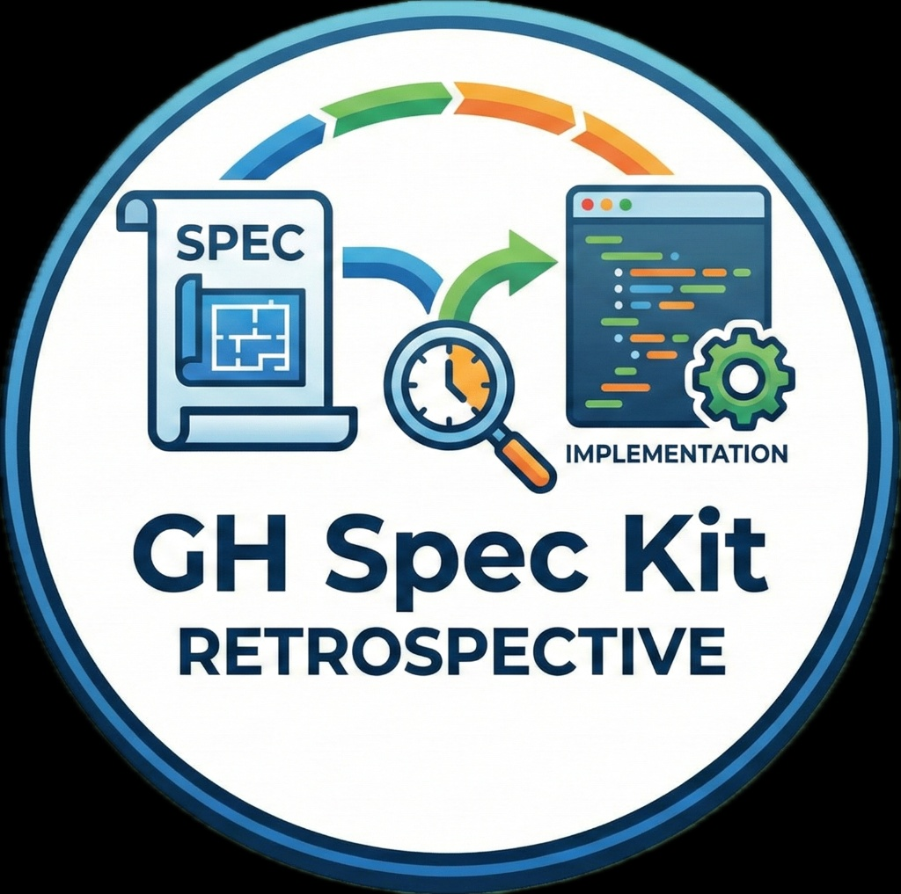

# Retrospective Extension for Spec Kit



Community extension that adds a post-implementation retrospective command focused on spec adherence, drift analysis, and actionable follow-up.

## Command

- `/speckit.retrospective.analyze`

## What It Does

- Checks implementation completeness from `tasks.md`
- Compares implementation against `spec.md` and `plan.md`
- Calculates a spec adherence score
- Produces `retrospective.md` in the feature directory
- Highlights critical/significant/minor/positive deviations
- Suggests follow-ups for constitution/spec/checklist updates

## Install

### From GitHub release

```bash
specify extension add --from https://github.com/emi-dm/spec-kit-retrospective/archive/refs/tags/v1.0.0.zip
```

### Local development

```bash
specify extension add --dev /path/to/extensions/retrospective
```

## Verify

```bash
specify extension list
```

Then run from your AI assistant:

```text
/speckit.retrospective.analyze
```

## Safety and Quality Gates

- **Human Gate for spec updates**: if retrospective recommends changing `spec.md`, the command must ask for explicit confirmation before any modification.
- **Safe default**: any ambiguous input is treated as **No**.
- **Self-assessment checklist**: the command validates coverage, metrics, constitution compliance, and actionability before finalizing output.
- **Blocking criteria**: if critical checklist items fail, report finalization is blocked until gaps are fixed.

## Output

The command writes `retrospective.md` to the feature directory and includes:

- Executive summary and key metrics
- Requirement coverage matrix (FR/NFR/SC)
- Architecture drift and significant deviations
- Proposed spec changes (for approval before applying)
- Constitution compliance review
- Prioritized recommendations and traceability appendix

## Quick Test Plan

Validate these scenarios:

1. `completion_rate >= 80%`
 - Expect full retrospective output and report generation.
2. `completion_rate` between `50%` and `79%`
 - Expect warning plus partial-analysis mode.
3. `completion_rate < 50%`
 - Expect explicit confirmation before continuing.
4. Spec-change recommendation appears
 - Expect `Human Gate` question before any `spec.md` change.
5. Human Gate rejection or ambiguous input
 - Inputs other than `y/yes/si/s/sí` must be treated as NO, with no spec modification.

## Requirements

- Spec Kit `>=0.1.0`
- A feature with `spec.md`, `plan.md`, and `tasks.md`

## Release

1. Bump version in `extension.yml`
2. Update `CHANGELOG.md`
3. Tag release (e.g. `v1.0.0`)
4. Publish on GitHub
5. Submit to Spec Kit community catalog (`extensions/catalog.community.json`)

## License

MIT
